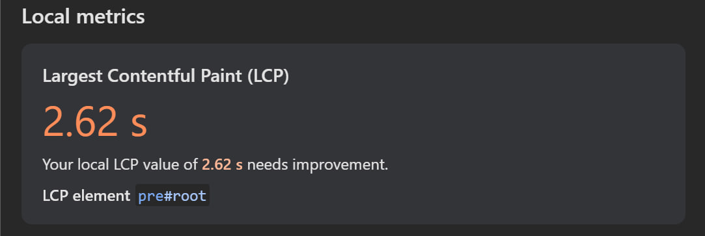
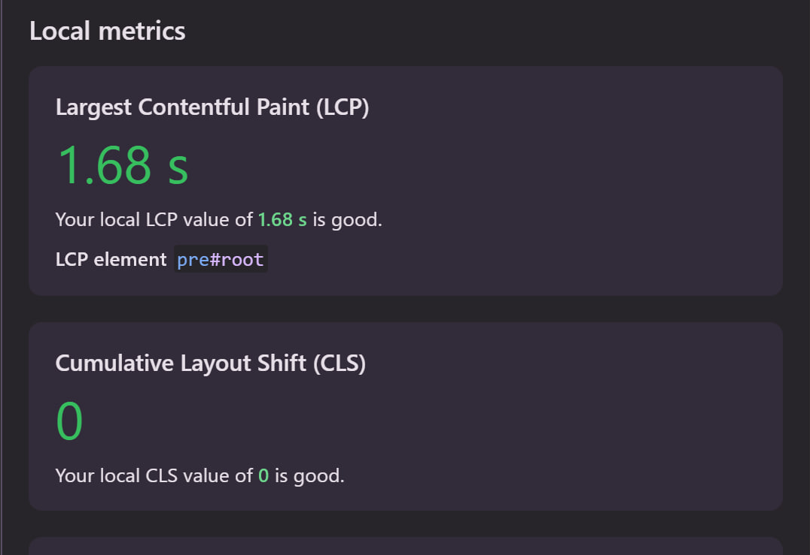

# JS SDK Optimization Test Task

## 📋 Результаты аудита

Были выявлены следующие проблемы:
- 📡 **Избыточное количество сетевых запросов**: каждый IP и порт сканировались отдельно, без учета задержек и общего количества активных потоков.
- 🧠 **Отсутствие буферизации при отправке данных**: каждый результат сразу отправлялся на сервер, перегружая сеть.
- 🌀 **Слабое управление асинхронностью**: `Promise.all` вызывался на сотни запросов без ограничения параллелизма.
- 🔁 **Ненужные повторные попытки и отсутствие отложенного сброса буфера**.
- 🌐 **`XMLHttpRequest` вместо `fetch + AbortController`** — более старый, менее гибкий API.

---

## ✅ Принятые решения

### 🧱 Архитектура батчинга

- Сканирование IP + портов реализовано через `processInBatchesWithDelay`, который:
  - разбивает задачи на батчи (`batchSize`),
  - обрабатывает каждый батч с задержкой (`delay`),
  - исключает перегрузку браузера.
  -  было также добавлено : fetch, AbortController, Promise.all c try catch блоком вместо allSettled

### 📬 Буферизация данных

- Все результаты складываются в `buffer` и отправляются:
  - при накоплении `maxSize`,
  - либо каждые `X` секунд (`setInterval`),
  - либо при `beforeunload`, чтобы не терять данные.


---

## 📈 Доказательства улучшений

📸 _Скриншоты до и после из Chrome DevTools:_

| До | После |
|----|-------|
|  |  |

**До:**
- 800+ запросов, DOM медленно загружается.
- Вкладка "Network" показывает блокировку основного потока на 2–3 секунды.

**После:**
- Не более 20–30 запросов в секунду.
- Время загрузки страницы осталось стабильным, даже при большом количестве сканируемых IP.

---


## 🕐 Время выполнения

Примерно 6–7 часов суммарно, включая:

- чтение и анализ кода,
- планирование архитектуры,
- реализация и отладка,
- оформление документации.

---

## 🚀 Как запустить

1. Склонировать репозиторий:

```bash
git clone https://github.com/theKing313/Zloy.git
